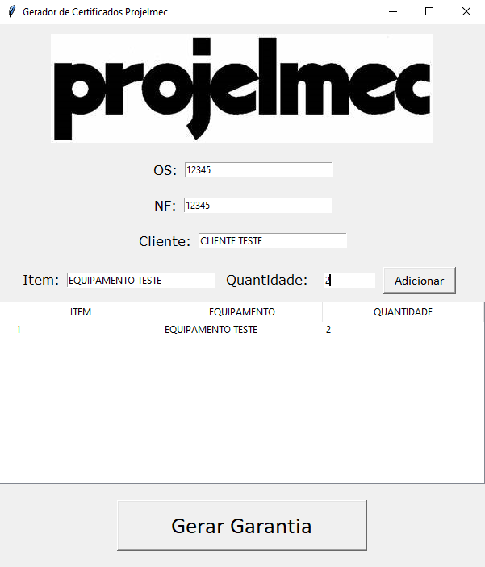

# Gerador de Documentos

Este projeto é uma solução prática para empresas que precisam gerar certificados de garantia e balanceamento de forma eficiente, reduzindo o tempo gasto na criação manual desses documentos e melhorando a consistência e profissionalismo dos certificados distribuídos.

## Descrição

Este projeto é uma aplicação de desktop construída com o objetivo de automatizar a criação e conversão de certificados de garantia e balanceamento para formato PDF. A aplicação utiliza várias bibliotecas Python para manipular documentos do Word, converter esses documentos para PDF, e criar uma interface gráfica de usuário (GUI). Aqui está uma descrição detalhada do projeto, com base nas informações disponíveis:

## Bibliotecas Utilizadas:

- docx: Para manipular documentos do Word (.docx), permitindo a edição ou substituição de texto dentro dos documentos.
- docx2pdf: Para converter os documentos editados do Word para PDF.
- tkinter: Para criar a interface gráfica de usuário (GUI), permitindo aos usuários interagir com a aplicação através de uma interface visual.
- PIL (Python Imaging Library): Provavelmente usada para manipular imagens dentro da aplicação, como inserir logotipos ou assinaturas nos certificados.

## Funcionalidades Principais:
- Geração de Certificados: A aplicação gera dois tipos de certificados - de garantia e de balanceamento. Para cada tipo, há um template específico armazenado em uma pasta de templates.
- Personalização de Certificados: Os certificados são personalizados com informações específicas do cliente, como nome do cliente, número da ordem de serviço (OS), e número da nota fiscal (NF). Essas informações são substituídas nos templates antes da conversão para PDF.
- Conversão para PDF: Após a personalização, os documentos são convertidos de .docx para .pdf, facilitando a distribuição e visualização dos certificados.
- Interface Gráfica de Usuário (GUI): A aplicação possui uma GUI para facilitar a interação do usuário com as funcionalidades de geração e personalização dos certificados. A GUI é construída usando tkinter, e pode incluir campos de entrada para as informações do cliente, botões para gerar os certificados, e talvez uma visualização prévia dos templates.

## Estrutura do Projeto:
- Templates: Os templates dos certificados estão armazenados em uma pasta específica e são usados como base para a geração dos certificados personalizados.
- Saída de Certificados: Os certificados gerados são salvos em pastas específicas para cada tipo de certificado (GARANTIA e BALANCEAMENTO), facilitando a organização e recuperação dos documentos.

## Fluxo de Trabalho:
- Entrada de Dados do Cliente: O usuário insere as informações do cliente que serão incluídas no certificado.
- Geração do Certificado: A aplicação substitui as variáveis no template do certificado com as informações fornecidas, gera o documento do Word personalizado, e então converte esse documento para PDF.
- Salvamento e Distribuição: O certificado em PDF é salvo na pasta de saída correspondente, pronto para ser impresso ou enviado ao cliente.

## Instalação

Para utilizar o projeto, siga as instruções abaixo:

1. Python 3.x
2. docx
3. docx2pdf

## Contribuição

Se você deseja contribuir com o projeto, siga as diretrizes abaixo:

1. Faça um fork deste repositório.
2. Crie uma branch com o nome da sua feature ou correção.
3. Implemente suas alterações.
4. Faça um pull request para a branch principal.

## Licença

Este projeto está licenciado sob a [MIT License](https://opensource.org/licenses/MIT).
